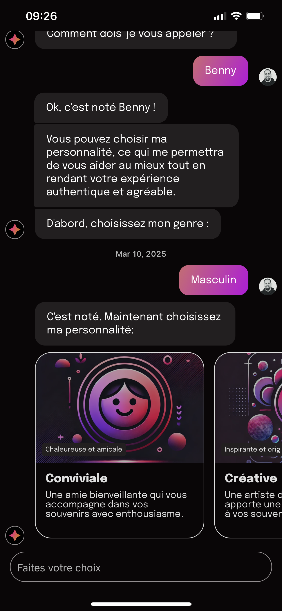
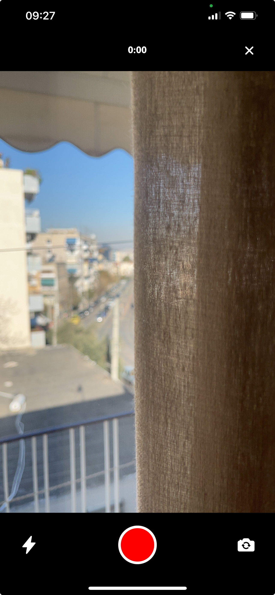
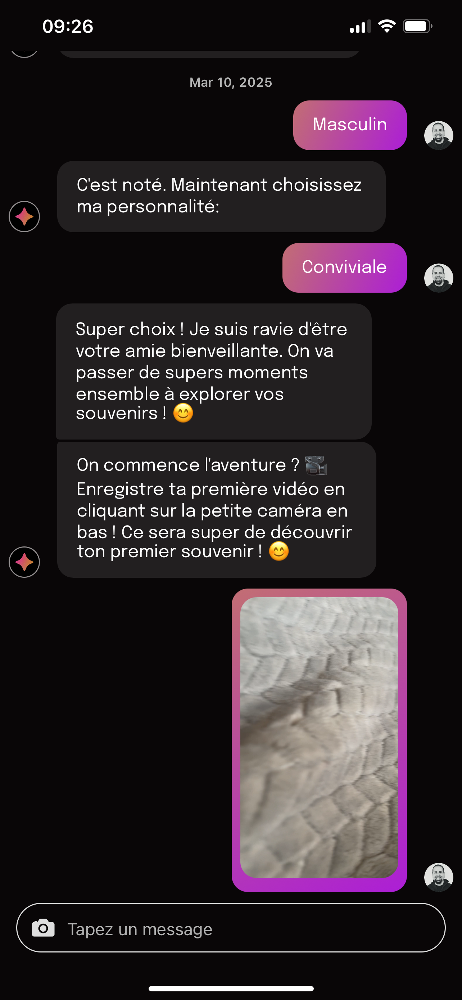

# Technical test: chatbot

### Screenshots

<p align="center">



</p>


### Technical choices

- Mobile framework: **Expo**

Battle tested, great DX ecosystem, extensive and well maintained packages and plugins libraries


- Language safety: **Typescript**

Strict mode, important to avoid type mistakes and consistency

Linting and formatting: **Biome.js**

Battle tested, faster than Eslint and Prettier, easier configuration, two tools in one

- Chat UI library: **React Native Gifted Chat**

Albeit not amazing, still the best open source solution out there

- Testing: **Maestro**

Battle tested, easy yaml testing flow definition with great DX (maestro studio)

- Deployment: **Expo EAS internal testing**

Quick and easy to setup for simple distribution for simple user testing (unlike ios Testflight and Android Google Play Console)


### Files structure

Feature based folder structure

### How to run

Install yarn on your computer

```bash
yarn
yarn start
```
This will give you options to run on ios or android

### UI inspiration

https://dribbble.com/shots/25640525-Mobile-AI-Chatbot

### Notes on the development process

Total work time: 2.5 days

Development environement: Mac OS, Cursor (Pro subscription), XCode

Difficulties:

Gifted Chats is outdated (class components), some types are missing, not the best API, some elements are hard to personalize

Different behaviours on Android and IOS with the Expo camera libraries
